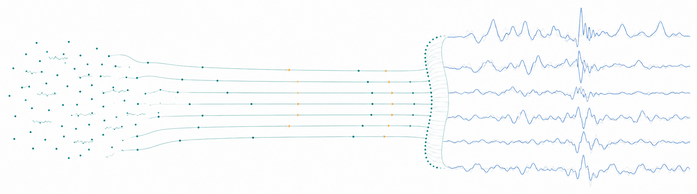

<p align="center">
  
</p>

<h1 align="center">LRF-IMU</h1>

<p align="center"><strong>Latent Rectified Flow for class-conditioned synthetic wearable IMU generation</strong></p>

<p align="center">
  <a href="https://github.com/aminsens/LRF-IMU/actions/workflows/ci.yml"></a>
  <a href="https://doi.org/10.1088/3049-477X/ae91ef"></a>
</p>

<p align="center">
  <strong>A latent rectified flow approach to generate synthetic wearable data – a LABDA solution</strong><br>
  Amin Rezaei · Morten Kjærgaard · Jasper Schipperijn<br>
  <em>Machine Learning: Health</em> (2026) · <a href="https://doi.org/10.1088/3049-477X/ae91ef">DOI: 10.1088/3049-477X/ae91ef</a>
</p>

LRF-IMU provides a reproducible implementation of class-conditioned latent Rectified Flow for synthetic wearable inertial signals, including the paper's 6-channel IMU setting and separately trained 3-channel accelerometer-only ablation.

## 🔥 News

- **2026-07-29** — Accepted Manuscript available online in *Machine Learning: Health* (IOP Publishing).
- **2026-06-29** — Paper accepted for publication in *Machine Learning: Health*.
- **2026-06-08** — R2 revision submitted (`MLHEALTH-100129.R2`).
- **2025-12-31** — Initial manuscript submitted to *Machine Learning: Health*.

## 📖 Introduction

LRF-IMU is a class-conditioned generative framework for wearable inertial signals. It combines a variational autoencoder (VAE) with latent Rectified Flow to generate synthetic time-domain sensor windows for human activity recognition.

The primary study configuration uses a **6-channel right-thigh IMU** with triaxial accelerometer and triaxial gyroscope signals. The paper also includes a separately trained **3-channel accelerometer-only ablation**, where both the VAE and Rectified Flow model are retrained using only `ax`, `ay`, and `az`. The codebase includes data preparation, generation, downstream evaluation, analysis, and reproducibility workflows for both configurations.

The core generation pipeline is:

```text
activity label + Gaussian noise
              ↓
class-conditioned Rectified Flow
        in VAE latent space
              ↓
        frozen VAE decoder
              ↓
      synthetic IMU window
```

Two sensor configurations are supported:

| Configuration | Channels | Input shape | Purpose |
| --- | ---: | --- | --- |
| Full IMU | 6 | `B × 6 × 160` | Main study configuration |
| Accelerometer-only | 3 | `B × 3 × 160` | Sensor-reduction ablation |

## 📊 Study setting

| Item | Setting |
| --- | --- |
| Dataset | REALDISP |
| Sensor placement | Right thigh, ideal placement |
| Participants | 12 complete participants |
| Activities | Walking, running, jump-up, cycling |
| Sampling rate | 50 Hz |
| Window length | 160 samples / 3.2 s |
| Hop | 40 samples / 0.8 s |
| Overlap | 75% |
| Validation | 12-fold leave-one-subject-out (LOSO) |
| Normalization | Training-only z-score |
| Generation | 10 reverse-Euler Rectified Flow steps |

The participant IDs used in the study are:

```text
1, 2, 3, 5, 8, 9, 10, 11, 12, 13, 14, 16
```

## 📈 Main results

The table below summarizes the paper's downstream classification results across all 12 LOSO folds. Values are macro F1, mean ± SD.

| Scenario | 6-ch RF | 3-ch RF | 6-ch CNN | 3-ch CNN |
| --- | ---: | ---: | ---: | ---: |
| TRTR — full real training | **0.985 ± 0.021** | **0.980 ± 0.027** | **1.000 ± 0.000** | **0.957 ± 0.083** |
| Scarce — 2 real samples/class | 0.400 ± 0.088 | 0.467 ± 0.082 | 0.340 ± 0.190 | 0.441 ± 0.202 |
| TSTR — synthetic-only training | **0.956 ± 0.081** | **0.980 ± 0.061** | 0.845 ± 0.195 | 0.954 ± 0.085 |
| TSTR + scarce real data | **0.951 ± 0.087** | **0.979 ± 0.061** | 0.858 ± 0.145 | 0.969 ± 0.058 |

For the main 6-channel Random Forest evaluation, synthetic-only training retained **97.1%** of the full-real baseline performance.

### 3-channel accelerometer-only ablation

The accelerometer-only experiment tests whether the pipeline remains useful when gyroscope channels are unavailable. This is not an inference-time channel drop: the **VAE and Rectified Flow models are retrained from scratch on the three accelerometer axes**.

With all real training data, the 3-channel Random Forest reached **0.980 ± 0.027** macro F1. Under the extreme low-data setting of only two real windows per class, performance increased from **0.467 ± 0.082** to **0.979 ± 0.061** after synthetic augmentation, recovering approximately **99.9%** of the full-data 3-channel baseline. In the paper, 9 of 12 held-out participants reached macro F1 = 1.0 after augmentation in this setting.

The corresponding generative audit also showed stable coverage under channel reduction: the 3-channel coverage ratio was **99.3% ± 2.3%**, with PCA area ratio **0.889 ± 0.072**.

## 💿 Installation

Clone the repository:

```bash
git clone https://github.com/aminsens/LRF-IMU.git
cd LRF-IMU
```

Create an environment and install the research dependencies:

```bash
python -m venv .venv

# Linux / macOS
source .venv/bin/activate

# Windows PowerShell
.venv\Scripts\Activate.ps1

python -m pip install --upgrade pip
python -m pip install -e ".[training,evaluation,analysis,test]"
```

Python 3.10 or newer is supported.

## 🚀 Quick start

The model implementations can be tested without REALDISP or historical checkpoints:

```bash
python -m lrf_imu vae-smoke
python -m lrf_imu flow-smoke
```

Both commands run on CPU.

## 📦 Dataset

REALDISP is not distributed with this repository. Obtain the dataset separately from its original source and point the preprocessing commands to your local copy.

Validate a participant-held-out fold with:

```bash
python -m lrf_imu prepare-data \
    --data-root <realdisp-root> \
    --held-out-subject 1 \
    --sensor-configuration six_channel \
    --validate-only
```

See [`DATA_ACCESS.md`](DATA_ACCESS.md) for the expected file layout and preprocessing assumptions.

## 🧠 Model configurations

The paper configurations are provided under `configs/paper/`:

```text
configs/paper/
├── six_channel_160_40.yaml
├── accelerometer_only_160_40.yaml
└── sensitivity_grid.yaml
```

Use `six_channel_160_40.yaml` for the full accelerometer + gyroscope experiment and `accelerometer_only_160_40.yaml` for the separately trained 3-channel ablation.

The reported TSTR results use **10 reverse-Euler steps**. The separate 100-step trajectory profile used for visualization is not part of the paper's TSTR inference protocol.

## 🧪 Generate synthetic IMU

With compatible VAE and Rectified Flow checkpoints:

```bash
python -m lrf_imu generate \
    --config configs/paper/six_channel_160_40.yaml \
    --vae-checkpoint <vae-checkpoint> \
    --flow-checkpoint <flow-checkpoint> \
    --class-id 0 \
    --count 1 \
    --steps 10 \
    --seed 42 \
    --device cpu
```

For the accelerometer-only model, use:

```text
configs/paper/accelerometer_only_160_40.yaml
```

with checkpoints trained for the 3-channel configuration.

## 🧾 Evaluate a LOSO fold

```bash
python -m lrf_imu evaluate \
    --data-root <realdisp-root> \
    --sensor six_channel \
    --classifier rf \
    --held-out-subject 1 \
    --synthetic-cache <external-cache> \
    --scenario trtr \
    --scenario tstr
```

The evaluator checks the supplied synthetic cache and its adjacent identity metadata before use.

## 🔁 Reproduce the experiment

The end-to-end workflow is:

```text
prepare REALDISP fold
        ↓
load VAE + Rectified Flow checkpoints
        ↓
generate class-conditioned synthetic windows
        ↓
evaluate TRTR / scarce / TSTR / TSTR+scarce
        ↓
aggregate across LOSO folds
```

Example:

```bash
python -m lrf_imu reproduce-core \
    --data-root <realdisp-root> \
    --checkpoint-root <checkpoint-root> \
    --output-root <external-output> \
    --sensor six_channel \
    --held-out-subject 1 \
    --classifier rf \
    --write-results
```

Use `--all-folds` for the 12-fold experiment and `--resume` for checksum-validated continuation of an interrupted run.

See [`REPRODUCIBILITY.md`](REPRODUCIBILITY.md) for the full workflow.

## ✅ Reproducibility notes

The repository was checked against the original research implementation and historical model artifacts. The VAE, Rectified Flow implementation, checkpoint loading, and deterministic 10-step generation reproduce the corresponding original operations numerically when run with matching inputs and checkpoints.

Evaluation also reproduces the stored historical subject-01 result exactly when supplied the same historical synthetic cache.

Freshly generated samples are not expected to be bitwise identical across all runtime/device combinations. In particular, the historical synthetic caches were associated with CUDA generation while the reproducibility checks also exercised fresh CPU generation; same-seed CPU and CUDA random streams are not bitwise identical.

Known historical configuration and artifact-lineage differences are documented in [`docs/KNOWN_DISCREPANCIES.md`](docs/KNOWN_DISCREPANCIES.md), and regenerated experiment results are summarized in [`docs/RESULTS_REPRODUCTION.md`](docs/RESULTS_REPRODUCTION.md).

## 📁 Project structure

```text
LRF-IMU/
├── src/lrf_imu/
│   ├── data/          # REALDISP preparation and LOSO splitting
│   ├── models/        # VAE and Rectified Flow models
│   ├── training/      # training objectives and utilities
│   ├── generation/    # latent-flow sampling
│   ├── evaluation/    # RF/CNN evaluation
│   └── analysis/      # sensitivity, spectral, physical and privacy analyses
├── configs/           # experiment configurations
├── contracts/         # machine-readable parity and provenance records
├── docs/              # scientific reproduction notes
├── tests/             # synthetic fixtures and regression tests
├── DATA_ACCESS.md
├── MODEL_CARD.md
├── REPRODUCIBILITY.md
└── CITATION.cff
```

Historical VAE/Rectified Flow checkpoints, REALDISP participant data, generated synthetic datasets, and historical result payloads are not stored in this repository.

## 📚 Documentation

- [`REPRODUCIBILITY.md`](REPRODUCIBILITY.md) — experiment workflow and reproducibility guidance
- [`DATA_ACCESS.md`](DATA_ACCESS.md) — REALDISP access and expected layout
- [`MODEL_CARD.md`](MODEL_CARD.md) — model scope and limitations
- [`docs/RESULTS_REPRODUCTION.md`](docs/RESULTS_REPRODUCTION.md) — regenerated experiment results
- [`docs/KNOWN_DISCREPANCIES.md`](docs/KNOWN_DISCREPANCIES.md) — known historical configuration differences
- [`docs/THREE_CHANNEL_LINEAGE.md`](docs/THREE_CHANNEL_LINEAGE.md) — accelerometer-only configuration lineage

## 📝 Citation

If you use LRF-IMU, please cite the associated paper:

```bibtex
@article{rezaei2026lrfimu,
  title     = {A latent rectified flow approach to generate synthetic wearable data -- a LABDA solution},
  author    = {Rezaei, Amin and Kjærgaard, Morten and Schipperijn, Jasper},
  journal   = {Machine Learning: Health},
  year      = {2026},
  doi       = {10.1088/3049-477X/ae91ef},
  publisher = {IOP Publishing}
}
```

Machine-readable citation metadata is also available in [`CITATION.cff`](CITATION.cff).

## ⚠️ Scope and limitations

The reported experiments cover the documented REALDISP setting: ideal placement, one right-thigh sensor, four activities, and 12 participant-held-out folds. Results should not be assumed to transfer unchanged to other placements, populations, sampling rates, activities, devices, or clinical settings without further evaluation.

Synthetic samples should not be treated as automatically anonymized. The privacy analyses in the paper evaluate specific reconstruction and membership-inference threat models and do not establish a universal privacy guarantee.
